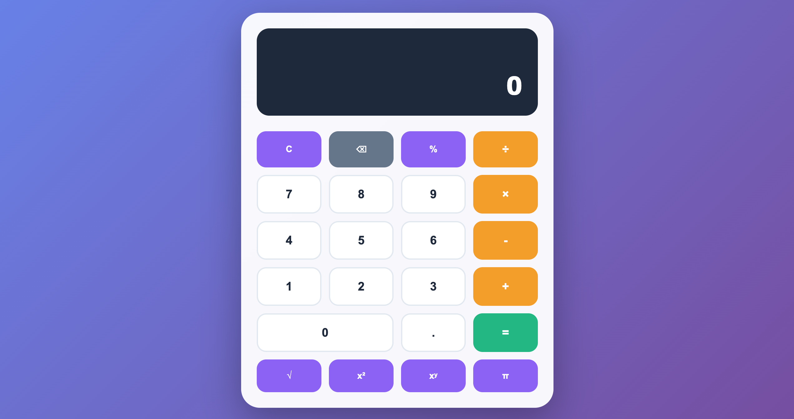

# Calculadora Científica – Trabalho de Curso

## Preview do Projeto

## Informações do Projeto

Repositório destinado à organização e apresentação dos projetos desenvolvidos na disciplina Responsive Web Development, do curso de Análise e Desenvolvimento de Sistemas (ADS) da Universidade do Vale do Itajaí (UNIVALI) — 2026.

Este projeto foi desenvolvido como parte das atividades do fórum da disciplina, com o objetivo de criar uma calculadora completa utilizando HTML, CSS e JavaScript.

A calculadora simula um equipamento científico digital com funcionalidades básicas e avançadas, utilizando conceitos de estruturação HTML, estilização com CSS e lógica de programação com JavaScript.

Este repositório contém o código-fonte completo da aplicação.

## Link do Projeto

A página pode ser acessada através do GitHub Pages:

🔗 https://github.com/Felipixel-Martins/ads-responsive-web-development/tree/main/calculadora

🔗 https://felipixel-martins.github.io/ads-responsive-web-development/calculadora/

## Objetivos da Atividade

- Desenvolver uma calculadora funcional utilizando HTML, CSS e JavaScript
- Estruturar corretamente os elementos da interface (display e botões)
- Implementar lógica de programação com JavaScript
- Tratar erros matemáticos (divisão por zero, raízes negativas)

## Tecnologias utilizadas no projeto

Este projeto foi desenvolvido utilizando as seguintes tecnologias:

| Tecnologia | Versão | Finalidade |
|------------|--------|-------------|
| HTML5 | - | Estrutura da aplicação |
| CSS3 | - | Estilização e responsividade |
| JavaScript | ES6+ | Lógica da calculadora |
| CSS Grid | - | Organização dos botões |
| CSS Flexbox | - | Layout responsivo |

## Estrutura do Projeto
