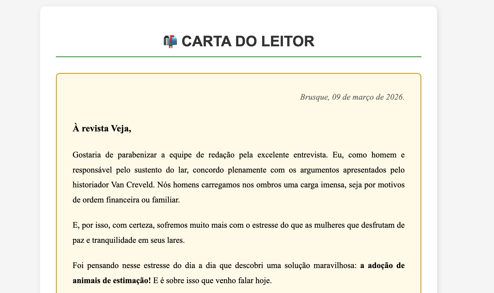

# Carta do Leitor – ONG "Amigos de Patas"



## Informações do Projeto

Repositório destinado à **organização e apresentação dos projetos desenvolvidos na disciplina Responsive Web Development 2**, do curso de **Análise e Desenvolvimento de Sistemas (ADS)** da **Universidade do Vale do Itajaí (UNIVALI) — 2026**.

Este projeto foi desenvolvido como parte das atividades do **fórum da disciplina**, com o objetivo de criar uma **página web que apresenta uma Carta do Leitor** representando a ONG fictícia **"Amigos de Patas"**.

A página simula um conteúdo informativo e institucional voltado à conscientização sobre **proteção e cuidado com animais**, utilizando conceitos básicos de **estruturação HTML e estilização com CSS**.

Este repositório contém o **código-fonte completo da aplicação**.

---

## Link do Projeto

A página pode ser acessada através do GitHub Pages:

🔗 https://felipixel-martins.github.io/carta-ong/

---

## Objetivos da Atividade

- Desenvolver uma **página web simples utilizando HTML**
- Estruturar corretamente o conteúdo textual da carta
- Aplicar **boas práticas de marcação semântica**
- Utilizar **CSS para estilização da página**
- Praticar a organização de conteúdo em um projeto web

---

## Funcionalidades

O projeto apresenta uma **Carta do Leitor institucional**, contendo:

- Estrutura de **título e subtítulos**
- Organização do conteúdo textual
- Estilização da página com CSS
- Apresentação de uma **mensagem de conscientização sobre o cuidado com animais**

A proposta é demonstrar na prática a **estruturação de páginas estáticas utilizando HTML e CSS**.

---

## Tecnologias utilizadas no projeto

Este projeto foi desenvolvido utilizando as seguintes tecnologias:

- **HTML5**
- **CSS3**

---

## Como posso editar este código?

Existem várias maneiras de editar a aplicação.

### Usar sua IDE preferida

Se você deseja trabalhar localmente utilizando sua própria IDE (como **VS Code, WebStorm, entre outras**), basta clonar este repositório e fazer as alterações necessárias.

---

## Passo a passo para executar o projeto

```sh
# Passo 1: Clone o repositório utilizando a URL do projeto
git clone <URL_DO_SEU_REPOSITORIO>

# Passo 2: Acesse a pasta do projeto
cd <NOME_DO_PROJETO>
