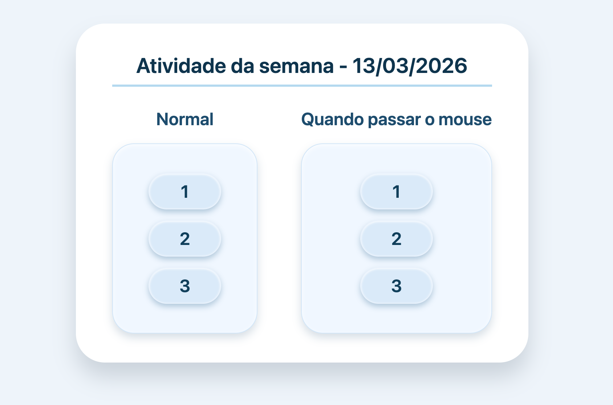

# Responsive Web Development – Atividade Semanal



## Informações do Projeto

Repositório destinado à **organização e apresentação dos projetos desenvolvidos na disciplina Responsive Web Development**, do curso de **Análise e Desenvolvimento de Sistemas (ADS)** da **Universidade do Vale do Itajaí (UNIVALI) — 2026**.

Este projeto foi desenvolvido como parte de uma **atividade semanal**, com foco na criação de **links em HTML** e na aplicação de **classes e combinadores em CSS**.

O projeto demonstra conceitos fundamentais de **estruturação de listas, navegação por links e estilização utilizando diferentes seletores CSS**.

Este repositório contém o **código-fonte completo**.

---

## Objetivos da Atividade

- Estruturar **listas não ordenadas** utilizando a tag `ul`
- Criar **links navegáveis** com a tag `a`
- Utilizar **classes CSS** para estilização específica
- Aplicar diferentes **combinadores CSS**

### Combinadores utilizados

- **Combinador descendente** (` `)
- **Combinador filho** (`>`)
- **Combinador irmão adjacente** (`+`)
- **Pseudo-classe hover** (`:hover`)

---

## Funcionalidades

O projeto consiste em **duas caixas interativas** que demonstram diferentes comportamentos visuais ao passar o mouse:

**Normal**
- Apenas os **links individuais reagem ao hover**

**Interação da Caixa**
- Quando o **mouse passa sobre toda a caixa**, todos os elementos internos recebem alteração visual

Essa abordagem demonstra na prática o funcionamento de **diferentes combinadores e pseudo-classes do CSS**.

---

## Tecnologias utilizadas no projeto

Este projeto foi desenvolvido utilizando as seguintes tecnologias:

- **HTML5**
- **CSS3**

---

## Como posso editar este código?

Existem várias maneiras de editar a aplicação.

### Usar sua IDE preferida

Se você deseja trabalhar localmente utilizando sua própria IDE (como **VS Code, WebStorm, entre outras**), basta clonar este repositório e fazer as alterações necessárias.

---

## Passo a passo para executar o projeto

```sh
# Passo 1: Clone o repositório utilizando a URL do projeto
git clone <URL_DO_SEU_REPOSITORIO>

# Passo 2: Acesse a pasta do projeto
cd <NOME_DO_PROJETO>
