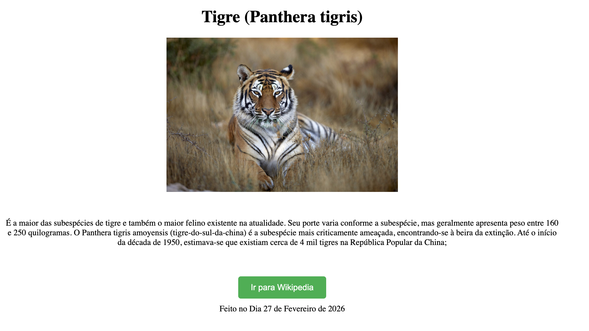

# Tigre (Panthera tigris)



## Informações do Projeto

Link da página:  
https://felipixel-martins.github.io/tigre-extincao/

Repositório para exibir o **Projeto do fórum da disciplina Responsive Web Development - UNIVALI ADS - 2026**.

Este projeto consiste em uma **página web simples** desenvolvida como parte das atividades do curso de **Análise e Desenvolvimento de Sistemas da Universidade do Vale do Itajaí (UNIVALI)**.

A página apresenta **informações sobre o tigre (*Panthera tigris*)**, abordando características da espécie e destacando a importância da **preservação desse animal ameaçado de extinção**.

Este repositório contém o **código-fonte da aplicação**.

---

## Tecnologias utilizadas no projeto

Este projeto foi desenvolvido utilizando as seguintes tecnologias:

- **HTML5**
- **CSS3**

---

## Como posso editar este código?

Existem várias maneiras de editar a aplicação.

### Usar sua IDE preferida

Se você deseja trabalhar localmente utilizando sua própria IDE (como **VS Code, WebStorm, entre outras**), basta clonar este repositório e fazer as alterações necessárias.

---

## Passo a passo para executar o projeto

```sh
# Passo 1: Clone o repositório utilizando a URL do projeto
git clone <URL_DO_SEU_REPOSITORIO>

# Passo 2: Acesse a pasta do projeto
cd <NOME_DO_PROJETO>
